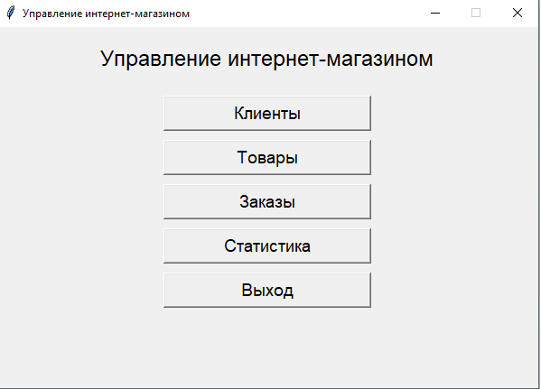

# 🛒 Интернет-магазин — Управление и статистика

Простое приложение для управления интернет-магазином с графическим интерфейсом на **Tkinter**, базой данных **SQLite** и визуализацией статистики. Позволяет управлять клиентами, товарами, заказами и просматривать аналитику.


---

## 📋 Основные функции

- **Управление клиентами**: добавление, редактирование, удаление, поиск.
- **Управление товарами**: контроль остатков и цен.
- **Управление заказами**: оформление, просмотр, удаление.
- **Статистика и аналитика**:
  - Топ-5 клиентов по заказам
  - Динамика заказов по датам
  - Граф связей клиентов и товаров
- **Экспорт данных** в CSV
- **Автоматическая валидация** данных (email, телефон, цена и т.д.)
- Полное **юнит-тестирование** и **документация Sphinx**

---

## 🖼 Скриншоты интерфейса

### Главное окно


### Управление клиентами


### Статистика: Топ-5 клиентов


> 💡 *Примечание: Чтобы добавить реальные изображения, поместите скриншоты в папку `docs/_images/` и обновите пути.*

---

## 🚀 Быстрый запуск

### 1. Клонируйте репозиторий

```bash
git clone https://github.com/kbobkov37/web_shop.git
cd online-store-app


web-shop/
│
├── main.py                     # Главное приложение 
├── gui.py                        # GUI
├── database.py               # Работа с SQLite
├── models.py                  # Классы Client, Product, Order
├── requirements.txt       # Зависимости
├── README.md            # Документация проекта
│
├── tests/
│   └── test_models.py        # Юнит-тесты
│
└── docs/
    ├── conf.py
    ├── index.rst
    ├── modules.rst
    ├── _static/
    ├── _templates/
    └── make.bat, Makefile    # Автогенерируются Sphinx
